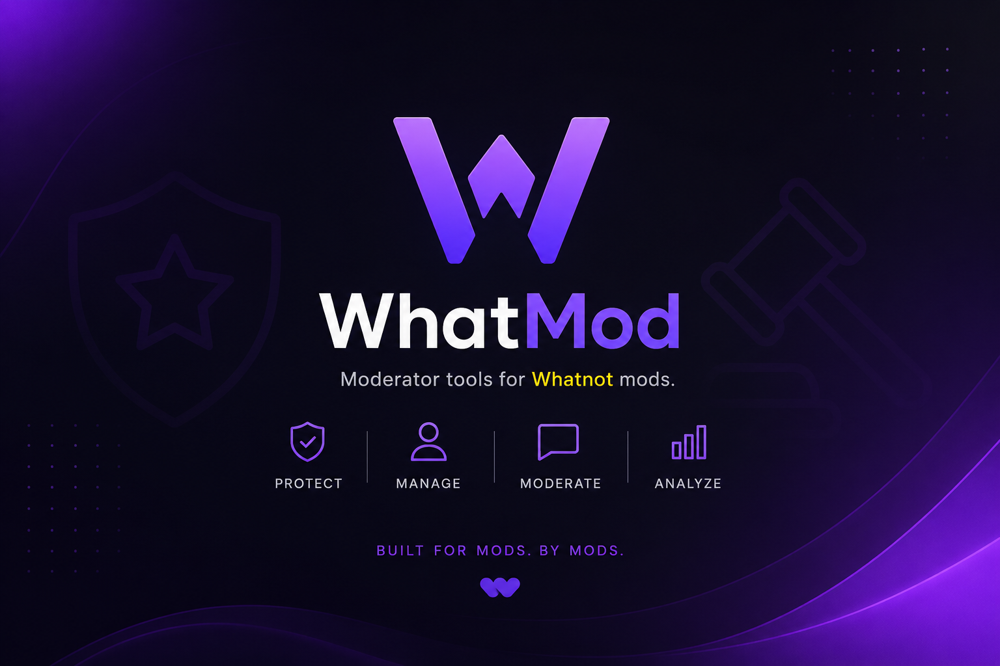

<!DOCTYPE html>
<html lang="en">
<head>
  <meta charset="UTF-8" />
  <meta name="viewport" content="width=device-width, initial-scale=1.0" />
  <meta name="description" content="WhatMod is a moderator toolkit built for Whatnot mods: quick messages, notes, hotkeys, giveaways, analytics, and stream workflow tools." />
  <meta property="og:title" content="WhatMod — Built for Mods. By Mods." />
  <meta property="og:description" content="Moderator tools for Whatnot mods. Protect, manage, moderate, and analyze live shopping streams." />
  <meta property="og:image" content="assets/cover.png" />
  <title>WhatMod | Moderator Tools for Whatnot Mods</title>
  <link rel="preconnect" href="https://fonts.googleapis.com">
  <link rel="preconnect" href="https://fonts.gstatic.com" crossorigin>
  <link href="https://fonts.googleapis.com/css2?family=Inter:wght@400;500;600;700;800;900&display=swap" rel="stylesheet">
  <link rel="stylesheet" href="styles.css" />
</head>
<body>
  

  <header class="site-header" id="top">
    <nav class="nav container">
      <a href="#top" class="brand" aria-label="WhatMod home">
        W
        WhatMod
      </a>
      <button class="menu-toggle" aria-label="Open menu" aria-expanded="false">☰</button>
      

        <a href="#features">Features</a>
        <a href="#workflow">Workflow</a>
        <a href="#editions">Editions</a>
        <a href="#faq">FAQ</a>
        <a class="nav-cta" href="#download">Get WhatMod</a>
      

    </nav>
  </header>

  <main>
    <section class="hero container">
      

        
Built for mods. By mods.

        <h1>Moderate faster, cleaner, and smarter with WhatMod.</h1>
        
WhatMod gives Whatnot moderators a polished command center for quick chat messages, giveaways, notes, hotkeys, browser controls, and stream-ready workflows.

        

          <a class="button primary" href="#download">Download / License</a>
          <a class="button ghost" href="#features">Explore Features</a>
        

        

          
<strong>1-click</strong>chat cards

          
<strong>Auto</strong>saved configs

          
<strong>Pro</strong>mod workflow

        

      

      

        
      

    </section>

    <section class="strip">
      

        ProtectManageModerateAnalyze
      

    </section>

    <section class="section container" id="features">
      

        
Everything a serious mod needs

        <h2>One toolkit for the moments that matter live.</h2>
        
From routine welcomes to giveaway chaos, WhatMod keeps your best responses and tools ready before chat gets away from you.

      

      

        <article class="feature-card reveal">
💬
<h3>Quick Message Banks</h3>
Pre-made mod messages organized into tabs for announcements, sizing, giveaways, rules, shoes, and more.
</article>
        <article class="feature-card reveal">
⚡
<h3>One-Click Send</h3>
Short card view and edit view make it simple to copy or send the exact message you need instantly.
</article>
        <article class="feature-card reveal">
📝
<h3>Live Notes</h3>
Track general notes, giveaway notes, and unique stream occurrences without leaving your workflow.
</article>
        <article class="feature-card reveal">
⌨️
<h3>Custom Hotkeys</h3>
Assign rapid-fire actions for repetitive mod moments and keep both hands in the action.
</article>
        <article class="feature-card reveal">
🧩
<h3>Persistent Configs</h3>
Autosave your setup, message banks, tabs, and preferences with JSON-based local configuration.
</article>
        <article class="feature-card reveal">
🛡️
<h3>License Ready</h3>
Built with activation and update flows so WhatMod can grow from private tool into real software.
</article>
      

    </section>

    <section class="section showcase" id="workflow">
      

        

          

          
<button>Mod Messages</button><button>Giveaways</button><button>Sneakers</button>

          
<strong>Welcome Message</strong>
Welcome in! Tap follow, bookmark the show, and ask any questions in chat.
Send Now

          
<strong>Giveaway Reminder</strong>
Make sure you are following and eligible before entering the giveaway.
Copy

          
<b>Stream Notes</b>
Buyer asked about size 10.5 restock. Mention during next shoe run.

        

        

          
Designed around live pressure

          <h2>Less tab hunting. More stream control.</h2>
          
WhatMod turns scattered scripts, notes, and browser actions into a single operator panel. Mods can stay focused on chat, seller support, and keeping the room clean.

          <ul class="check-list">
            <li>Launch or reconnect browser controls</li>
            <li>Switch between compact cards and full edit mode</li>
            <li>Keep stream notes separated by context</li>
            <li>Build specialized tabs for different seller categories</li>
          </ul>
        

      

    </section>

    <section class="section container" id="editions">
      

        
Ready for different streams

        <h2>Core, Pro, and Sneaker-ready workflows.</h2>
      

      

        <article class="price-card reveal"><h3>WhatMod Core</h3>
For basic mod message organization.
<ul><li>Message cards</li><li>Category tabs</li><li>Copy workflow</li></ul></article>
        <article class="price-card featured reveal">Most Complete<h3>WhatMod Pro</h3>
For active mods who need speed and customization.
<ul><li>Hotkeys</li><li>Notes system</li><li>Persistent configs</li><li>Browser tools</li></ul></article>
        <article class="price-card reveal"><h3>Sneaker Edition</h3>
Purpose-built cards for shoe sellers and sizing-heavy streams.
<ul><li>Size cards</li><li>Shoe message bank</li><li>Giveaway prompts</li></ul></article>
      

    </section>

    <section class="section dark-panel container" id="download">
      

        
Launch your mod command center

        <h2>Bring WhatMod to your next show.</h2>
        
Replace this section with your GitHub release, Gumroad, Stripe checkout, Discord invite, or license activation link.

        

          <a class="button primary" href="https://github.com/" target="_blank" rel="noreferrer">View on GitHub</a>
          <a class="button ghost" href="mailto:you@example.com">Contact for Access</a>
        

      

    </section>

    <section class="section container faq" id="faq">
      

Questions
<h2>FAQ</h2>

      

Is WhatMod official Whatnot software?

No. WhatMod is an independent moderator utility. Update this copy if your relationship or permissions change.

      

Can I customize the messages?

Yes. The site showcases editable message banks, custom tabs, and persistent local configs.

      

Can I host this site on GitHub Pages?

Yes. Upload these files to a repository, enable GitHub Pages, and set the branch to deploy from the root folder.

    </section>
  </main>

  <footer class="footer">
    

      
©  WhatMod. Built for mods. By mods.

      <a href="#top">Back to top ↑</a>
    

  </footer>

  
</body>
</html>
